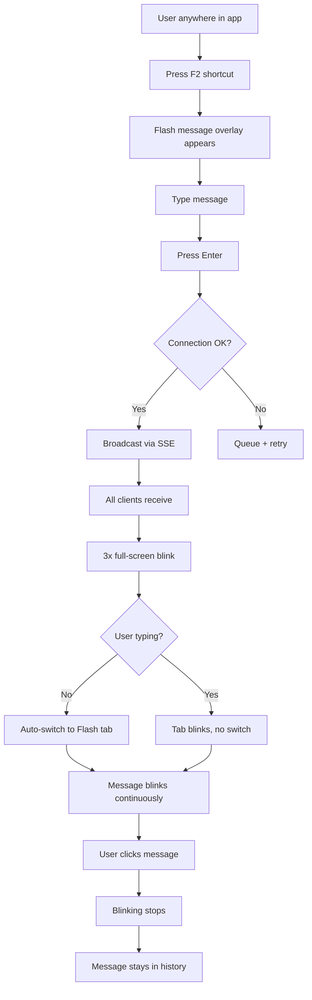
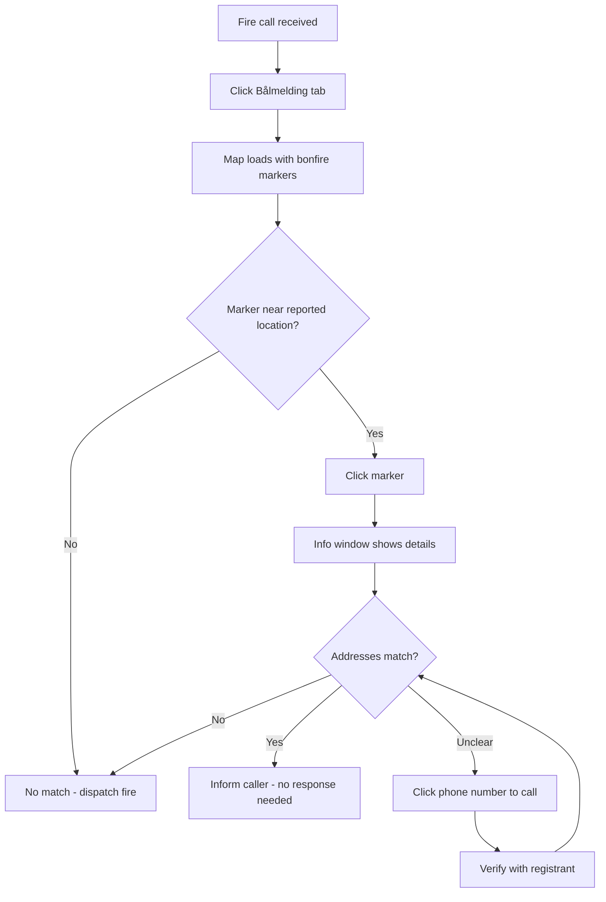
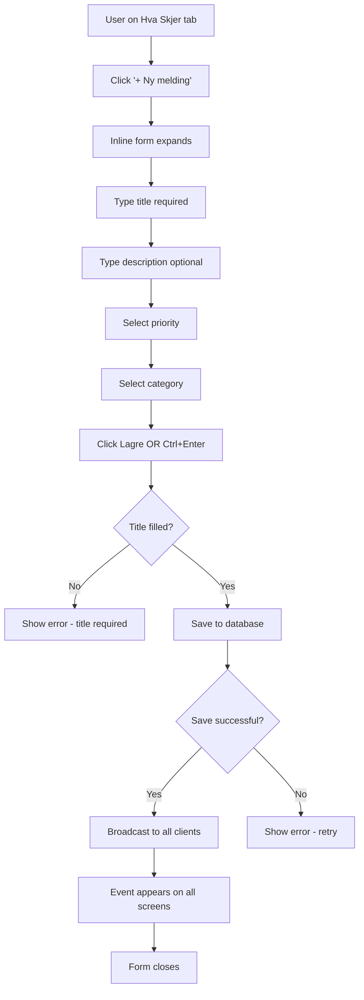
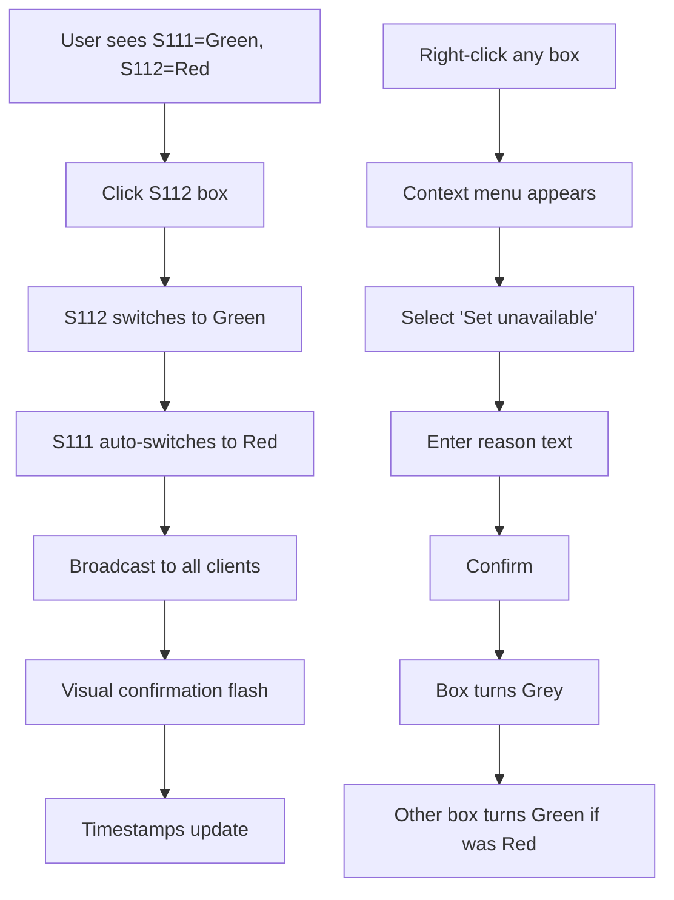

# Hva Skjer - UX Design Specification

_Created on 2025-11-18 by BIP_
_Generated using BMad Method - Create UX Design Workflow v1.0_

---

## Executive Summary

**Hva Skjer** is an emergency response coordination application designed for 24/7 high-pressure operations at 110 Sør-Vest emergency response center. The UX design focuses ruthlessly on speed and clarity, where **every interaction is measured in seconds** and information must be instantly comprehensible under stress.

### Design Philosophy

**Speed, Clarity, Trust** - Three principles that govern every UX decision:

1. **Speed**: Two-key shortcuts, instant visual feedback, zero unnecessary clicks
2. **Clarity**: Color-coded visual hierarchy, dedicated workspace areas, no cognitive overload
3. **Trust**: Professional aesthetics, reliable real-time sync, always-visible critical information

### Target Users

**Primary**: Emergency dispatchers (3-5 per shift) working 12-hour shifts in high-stress 24/7 operations handling life-threatening emergencies

**Context**: Multi-screen workstations (three 49" monitors), application occupies 1/4 screen (~1280x1440 or 2560x720), must integrate seamlessly without disrupting primary Locus Emergency Operation System

**User Goals**:
- Send urgent messages to all dispatchers instantly (< 2 seconds)
- Verify fire locations against registered bonfires (< 10 seconds)
- Maintain situational awareness of active events and vehicle status
- Coordinate operations without verbal communication or phone calls

### Platform

**Web application** designed to feel like native desktop software:
- No browser chrome (fullscreen app or PWA mode)
- Desktop-first design (tablet/mobile for future phases)
- Optimized for quarter-screen 49" monitor viewport
- Real-time synchronization across all dispatcher workstations

---

## 1. Design System Foundation

### 1.1 Design System Choice

**Selected Design System**: **shadcn/ui** with Tailwind CSS

**Rationale**:
- **Verified in architecture.md and technical-research.md** - already chosen for implementation
- Provides unstyled, accessible components (Radix UI primitives) with full customization control
- Perfect for emergency services professional aesthetic (no consumer-app "friendly" defaults)
- Copy-paste architecture enables performance optimization (tree-shaking, bundle size control critical for reliability)
- Tailwind enables rapid responsive layout adjustments for quarter-screen viewport
- Excellent TypeScript support and Next.js 14 App Router compatibility

**Components Provided by shadcn/ui**:
- Button (variants: default, destructive, outline, ghost)
- Card (structured content containers)
- Dialog/Modal (contextual overlays)
- Input/Textarea (form fields)
- Tabs (folder/tab navigation system)
- Badge (status indicators, priority labels)
- Alert (success/error feedback)
- Select/Dropdown (municipality selection, status dropdowns)

**Customization Strategy**:
- Emergency services color palette (professional reds, greens, grays)
- Increased font sizes for readability under stress (base 16px → 18px)
- Larger touch targets for buttons (44px minimum height)
- High contrast ratios (WCAG AA compliance minimum)
- Custom blinking animations for flash messages (attention-grabbing but not seizure-inducing)

---

## 2. Core User Experience

### 2.1 Defining Experience

**Core Defining Experience**: **"Instant Broadcast Communication"**

When someone describes Hva Skjer, they say:
> "It's the app where you press two keys and every dispatcher sees your message immediately. Everything else stays visible but out of the way until you need it."

**Primary User Action**: Send flash message (F2 + Enter or custom keyboard shortcut)

**What Makes This Unique**:
- **Zero navigation friction**: Keyboard shortcut works from anywhere in the app
- **Instant multi-screen broadcast**: Message appears on all 3-5 dispatcher screens simultaneously (< 1 second)
- **Smart context awareness**: Auto-switches to Flash tab unless user is typing (prevents disruption)
- **Attention-grabbing but professional**: 3 full-screen blinks, then continuous message line blinking until acknowledged

**Supporting Experiences**:
- **Glanceable map verification**: Click Bålmelding tab → instant visual confirmation of registered bonfire locations
- **Always-visible operational awareness**: Event dashboard and vehicle status always in view on "Hva Skjer" landing page
- **Effortless status updates**: Click to toggle vehicle availability (S111 ↔ S112 rotation)

### 2.2 Core Experience Principles

**Speed Principle**: **Sub-second response times for all critical actions**
- Flash message input to delivery: < 1 second
- Tab switching: Instant (no loading states)
- Map view load: < 2 seconds (with cached bonfire data)
- Event creation: < 3 seconds (minimal form friction)

**Guidance Principle**: **Zero training required (intuitive for experienced computer users)**
- Keyboard shortcuts follow Windows conventions (F2 for edit, Ctrl+S for save where applicable)
- Tab navigation uses Excel-like metaphor (familiar to government workers)
- Visual hierarchy eliminates need for user manual (color-coded priority immediately clear)
- Tooltips for advanced features only (not basic operation)

**Flexibility Principle**: **Professional discretion over rigid workflows**
- No required fields beyond essential (name, message, date)
- Operators can edit any event/status (trust-based, audit trail for accountability)
- Manual override always available (automation assists but doesn't restrict)
- All dispatchers have equal access (no complex permission tiers)

**Feedback Principle**: **Immediate, clear, non-disruptive**
- Real-time sync indicators (green dot = connected, red = disconnected)
- Visual confirmation for all actions (fade-in success, shake for errors)
- Blinking for critical attention (flash messages only)
- Subtle animations for status changes (smooth transitions, not jarring)

---

## 3. Visual Foundation

### 3.1 Color System

**Emergency Services Professional Theme**

**Primary Colors** (Critical Actions & Alerts):
- **Red #DC2626** (`red-600`): Pri 1 events, vehicle unavailable (out on assignment), destructive actions, error states
- **Amber #F59E0B** (`amber-500`): Warnings, pending validation, attention-needed states
- **Green #16A34A** (`green-600`): Vehicle available/ready, success states, completed events

**Neutral Palette** (Backgrounds & Structure):
- **Slate 950 #020617**: Primary background (dark mode default for low-light operations)
- **Slate 900 #0F172A**: Card backgrounds, elevated surfaces
- **Slate 800 #1E293B**: Borders, dividers
- **Slate 700 #334155**: Inactive states
- **Slate 300 #CBD5E1**: Text on dark backgrounds
- **Slate 100 #F1F5F9**: Light mode backgrounds (if requested)

**Accent Colors** (Information & Organization):
- **Blue #3B82F6** (`blue-500`): Links, informational states, selected tab
- **Violet #8B5CF6** (`violet-500`): Special categories (drills, smoke tests)
- **Gray #6B7280** (`gray-500`): Disabled states, secondary text

**Semantic Color Usage**:
- **Success**: Green #16A34A - Event resolved, bonfire validated, save successful
- **Warning**: Amber #F59E0B - Incomplete registration, pending review, timeout soon
- **Error**: Red #DC2626 - Failed to send, validation error, connection lost
- **Info**: Blue #3B82F6 - Help text, tooltips, informational badges

**Flash Message Blinking**:
- **Full-screen blink**: Background transitions slate-950 → amber-500/20 → slate-950 (200ms each, 3 cycles)
- **Message line blink**: Border + background amber-400 ↔ transparent (500ms pulse, continuous until clicked)

**Color Contrast Compliance**:
- All text on backgrounds meets WCAG AA (4.5:1 for normal text, 3:1 for large text)
- Red/green status uses **shape + color + text** (colorblind accessible)
- High contrast mode available in settings (future enhancement)

### 3.2 Typography System

**Font Families**:
- **Headings**: `Inter`, sans-serif (geometric, professional, excellent at large sizes)
- **Body**: `Inter`, sans-serif (consistency reduces cognitive load)
- **Monospace**: `"JetBrains Mono"`, monospace (timestamps, IDs, technical data)

**Type Scale** (Desktop - quarter-screen viewport):
- **H1**: 32px / 2rem - Page titles (rarely used, "Hva Skjer" folder title)
- **H2**: 24px / 1.5rem - Section headers ("Viktige meldinger", "Bilstatus")
- **H3**: 20px / 1.25rem - Card titles, modal headers
- **Body**: 18px / 1.125rem - Default text (larger than typical 16px for readability under stress)
- **Small**: 16px / 1rem - Secondary information, timestamps
- **Tiny**: 14px / 0.875rem - Input labels, helper text

**Font Weights**:
- **Bold (700)**: Headings, active tab labels, critical alerts
- **Semibold (600)**: Buttons, event titles, priority badges
- **Medium (500)**: Body text (slightly heavier than normal for dark mode readability)
- **Normal (400)**: Secondary text, descriptions

**Line Heights**:
- **Headings**: 1.2 (tighter for visual hierarchy)
- **Body**: 1.5 (comfortable reading)
- **Dense UI**: 1.3 (compact lists, tables)

### 3.3 Spacing & Layout System

**Base Unit**: 4px (Tailwind default)

**Spacing Scale**:
- **xs**: 4px (tight element spacing, icon padding)
- **sm**: 8px (compact card padding, input padding)
- **md**: 16px (default spacing between sections)
- **lg**: 24px (section spacing, card margins)
- **xl**: 32px (page margins, modal padding)
- **2xl**: 48px (large visual separation)

**Layout Grid**:
- **12-column CSS Grid** for "Hva Skjer" layout
  - Left column: 8 columns (Viktige meldinger - events list)
  - Right column: 4 columns (Bilstatus + Vaktplan stacked)
- **Responsive breakpoints**:
  - Desktop (>= 1024px): Full 12-column layout
  - Tablet (768px - 1023px): Single column stacked
  - Mobile (<768px): Future phase (not MVP scope)

**Container Widths**:
- **Quarter-screen viewport**: 1280x1440 (vertical orientation) OR 2560x720 (horizontal slice)
- **Maximum content width**: 100% of viewport (no centering, fill allocated screen space)
- **Minimum clickable area**: 44x44px (WCAG AAA touch target size)

---

## 4. Design Direction

### 4.1 Chosen Design Approach

**Design Direction**: **"Professional Dashboard - High Density"**

**Visual Philosophy**: Emergency Operations Center aesthetic - information-dense but organized, professional without being cold, optimized for speed over friendliness.

**Layout Decisions**:

**Navigation Pattern**: **Excel-like tabs (top horizontal)**
- Four tabs: "Hva Skjer" (home/dashboard), "Flash", "Bålmelding", "Innstillinger"
- Active tab: Blue underline + brighter text
- Inactive tabs: Dimmed text (slate-400)
- Blinking tab indicator: Amber pulse border when new flash arrives during typing
- Always visible, no hamburger menu or collapsible navigation

**Content Structure**: **Asymmetric two-column grid (8:4 ratio)**
- **Left column (8 cols)**: Primary content area
  - "Hva Skjer": Viktige meldinger (events list) with create/edit controls
  - "Flash": Flash message history (chronological, newest first)
  - "Bålmelding": Google Maps with bonfire POI markers
  - "Innstillinger": Settings panels
- **Right column (4 cols)**: Persistent status panels (only on "Hva Skjer")
  - Top: Bilstatus (S111/S112 vehicle status boxes)
  - Bottom: Vaktplan (duty roster table)

**Content Organization**: **Card-based with list views**
- Events: Stacked cards with clear dividers, priority color-coded left border
- Flash messages: Chronological list, most recent at top
- Bonfire map: Full-width interactive map with clickable markers
- Bilstatus: Two adjacent boxes (S111 | S112) with click-to-toggle

**Hierarchy Decisions**:

**Visual Density**: **Dense (information-rich)**
- Operators need maximum information on limited screen real estate
- Compact line heights (1.3) for lists
- Minimal whitespace within cards (8px padding)
- Generous whitespace between sections (24px) for visual grouping

**Header Emphasis**: **Bold headers with semantic color**
- Pri 1 events: Red left border + bold title
- Normal events: Default slate border
- Section headers: Semibold, 24px, slate-200
- Active flash message: Amber border + blinking until dismissed

**Content Focus**: **Text-focused with functional icons**
- Text-first design (event descriptions, flash messages, addresses)
- Icons for actions only (edit, delete, toggle status) - not decorative
- Map integration for visual bonfire verification (specialized view)
- No imagery or branding (pure functional interface)

**Interaction Decisions**:

**Primary Action Pattern**: **Inline editing with immediate save**
- Click event title to edit inline (no modal for quick edits)
- Click vehicle status box to toggle (no confirmation, trust + audit trail)
- Flash message: Keyboard shortcut → input overlay → broadcast on Enter
- Bonfire chatbot: Inline chat interface (no separate page)

**Information Disclosure**: **All-at-once on "Hva Skjer", progressive in specialized tabs**
- "Hva Skjer" dashboard: All active events + bilstatus + vaktplan visible simultaneously (no scrolling for key info)
- "Flash": History view (scroll through messages, paginated if needed)
- "Bålmelding": Map view (click marker to reveal details)
- "Innstillinger": Accordion sections (expand settings categories on demand)

**User Control**: **Flexible with smart defaults**
- Auto-switch to Flash tab on message arrival (smart behavior)
- Auto-return to "Hva Skjer" after 5 min inactivity (configurable in settings)
- Manual tab switching always works (no forced navigation)
- Event priority toggle (Pri 1 vs Normal)
- Vehicle status manual override (right-click for "out of service" with notes)

**Visual Style Decisions**:

**Weight**: **Balanced** (professional depth without heavy shadows)
- Subtle elevation with 1px borders (slate-700) instead of heavy box-shadow
- Hover states: Slight background lightening (slate-800 → slate-750)
- Active states: Blue accent border (3px left border for selected items)
- Focus states: 2px blue outline (WCAG accessibility)

**Depth Cues**: **Subtle elevation with functional layering**
- Base layer: slate-950 background
- Cards: slate-900 with 1px slate-700 border
- Modals: slate-900 with 20% black overlay
- Flash message overlay: amber-900/90 with backdrop blur
- No decorative shadows (only functional depth for modals/overlays)

**Border Style**: **Subtle 1px functional borders + semantic accent borders**
- Default: 1px slate-700 (structure without heaviness)
- Interactive hover: 1px slate-600 (slight brightening)
- Active/selected: 3px left accent border (blue for tabs, amber for flash, red for Pri 1)
- Focus: 2px outline (blue)

**Rationale**:
This design direction optimizes for **operational efficiency in a quarter-screen workspace**. Emergency dispatchers need:
1. **Maximum information density** without clutter (every pixel has purpose)
2. **Instant visual hierarchy** via color-coded priorities (no reading required to understand urgency)
3. **Professional reliability** (this is a tool, not a consumer app)
4. **Speed-optimized interactions** (keyboard shortcuts, click-to-toggle, inline editing)

The "Professional Dashboard - High Density" direction delivers a **desktop application feel** that integrates seamlessly into the multi-screen emergency operations environment without drawing attention to itself until critical information arrives (flash messages).

---

## 5. User Journey Flows

### 5.1 Critical User Paths

#### Journey 1: Send Flash Message (Primary Action)

**User Goal**: Broadcast urgent message to all dispatchers instantly

**Entry Point**: Any tab/folder in application

**Flow Approach**: **Keyboard-first with modal overlay**

**Detailed Flow**:

1. **Trigger** (anywhere in app)
   - User presses **F2** (or custom shortcut like Ctrl+Shift+M)
   - System shows: Overlay with focused text input (amber border, 50% transparent dark background)
   - System detects: If user was already typing (cursor in input field), store that context

2. **Input** (flash message overlay visible)
   - User sees: Large text input (full width, 72px height, 24px font size)
   - User types: Message (1-50 characters recommended, no hard limit enforced)
   - User sees: Character count below input (subtle, slate-400, "12 characters")
   - System prevents: Nothing (allow any length, operators know best)

3. **Send** (user confirms message)
   - User presses: **Enter** (broadcast immediately)
   - System shows: Brief success flash (green checkmark, 300ms fade)
   - System broadcasts: Message via SSE to all connected clients (target < 500ms)
   - System switches: All clients to "Flash" tab (unless typing detected)
   - System closes: Overlay, returns focus to previous context

4. **Receive** (on all other dispatcher screens)
   - System shows: 3 full-screen blinks (amber flash, 200ms on + 200ms off, 3 cycles)
   - System switches: Tab to "Flash" (if not typing)
   - System blinks: Flash tab label (if user was typing)
   - System blinks: New message line in Flash folder (amber border pulse, continuous)
   - User sees: Message at top of list, newest first

5. **Acknowledge** (recipient dismisses blink)
   - User clicks: Blinking message line anywhere
   - System stops: Blinking animation for that message only
   - System marks: Message as "acknowledged" (timestamp recorded)
   - System keeps: Message visible in history (scrollable list)

6. **Auto-return** (after 5 minutes inactivity)
   - System detects: No user interaction for 5 minutes
   - System switches: Tab back to "Hva Skjer" (unless new flash arrived)
   - System preserves: Message history for review

**Error Recovery**:
- **Connection lost during send**: Queue message locally, retry on reconnect, show orange "sending..." indicator
- **Send failed**: Show red error alert ("Failed to broadcast - check connection"), keep input text for retry
- **No recipients online**: Allow send anyway (audit trail), show info badge ("0 recipients currently connected")

**Alternative Path - Manual Tab Switch**:
- User can click "Flash" tab anytime (does not wait for auto-switch)
- Clicking Flash tab stops blinking immediately (same as clicking message)

**Mermaid Diagram**:


#### Journey 2: Verify Fire Location Against Bonfires

**User Goal**: Quickly determine if reported fire matches registered bonfire

**Entry Point**: Dispatcher receives fire call from citizen

**Flow Approach**: **Single-screen map view with click-to-reveal details**

**Detailed Flow**:

1. **Trigger** (fire call received via phone/Locus system)
   - User hears: "Fire reported at [address]"
   - User thinks: "Could this be a registered bonfire?"
   - User clicks: "Bålmelding" tab (single click, instant switch)

2. **Visual Scan** (map loads with all bonfire POI markers)
   - User sees: Google Maps with 50-200 POI markers (orange flame icons)
   - User sees: Search bar (top-left) for address/municipality filter
   - User scans: Map for fire location proximity
   - User identifies: Nearest bonfire marker to reported address

3. **Details** (if potential match found)
   - User clicks: Bonfire marker on map
   - System shows: Info window popup (above marker)
     - Registrant name
     - Phone number (click to call)
     - Address (full street address)
     - Bonfire size (small/medium/large)
     - Registered date/time
   - User compares: Reported address vs registered address

4. **Decision** (dispatcher evaluates match)
   - **Match found**: User thinks "This is the registered bonfire, not emergency"
     - User action: Inform caller (via phone) - no fire response needed
     - User closes: Info window, returns to "Hva Skjer" tab
   - **No match found**: User thinks "No bonfire here, dispatch fire units"
     - User action: Proceed with standard fire response via Locus system
     - User closes: Bålmelding tab

5. **Contact Registrant** (if clarification needed)
   - User clicks: Phone number in info window
   - System triggers: `tel:` link (click-to-call via computer telephony)
   - User speaks: To registrant (verify bonfire status)
   - User returns: To map, closes info window

**Total Time**: **< 10 seconds** (from tab click to decision made)

**Error Recovery**:
- **Map fails to load**: Show error message + "Reload Map" button, fallback to list view of bonfires (text table)
- **No markers visible**: Check municipality filter (may be filtered), show "Reset Filters" button
- **Marker click unresponsive**: Fallback to list view (searchable table below map)

**Alternative Path - Search First**:
- User types: Address in search bar (autocomplete from registered addresses)
- System highlights: Matching marker on map + opens info window
- User reviews: Details without visual scanning

**Mermaid Diagram**:


#### Journey 3: Create New Operational Event

**User Goal**: Log critical information for all dispatchers to see

**Entry Point**: "Hva Skjer" folder (dashboard landing page)

**Flow Approach**: **Inline form expansion with progressive disclosure**

**Detailed Flow**:

1. **Entry** ("Hva Skjer" dashboard active)
   - User sees: "Viktige meldinger" section (left column, 8 cols wide)
   - User sees: Existing event cards stacked vertically
   - User sees: "+ Ny melding" button (top-right of section, blue outline button)

2. **Create** (user initiates event creation)
   - User clicks: "+ Ny melding" button
   - System shows: Inline form (expands above first event card)
     - Title input (required, focus auto-set here)
     - Description textarea (optional, auto-grows to 3 lines)
     - Priority toggle (default: Normal, click for Pri 1)
     - Category select (dropdown: Veiarbeid, Brann, Gassbluss, Røyktest, Annet)
   - System hides: "+ Ny melding" button temporarily (prevent double-create)

3. **Input** (user fills form)
   - User types: Title (e.g., "E39 stengt - trafikkulykke")
   - User types: Description (optional details, e.g., "Mellom Forus og Sandnes, ventet åpning 18:00")
   - User clicks: Priority toggle if critical (Pri 1 → red border + "Prioritert" badge appears)
   - User selects: Category from dropdown (e.g., "Veiarbeid")

4. **Save** (user confirms creation)
   - User clicks: "Lagre" button (green, primary) OR presses **Ctrl+Enter**
   - System validates: Title not empty (only required field)
   - System saves: Event to database (Prisma → PostgreSQL)
   - System broadcasts: New event via SSE to all clients (real-time sync)
   - System shows: Success feedback (green fade-in, 500ms)
   - System closes: Inline form
   - System reveals: "+ Ny melding" button again

5. **Display** (event appears on all dispatcher screens)
   - System adds: New event card to top of list
   - System shows: Event with color-coded left border (red if Pri 1, slate if Normal)
   - System displays: Title (bold), description, category badge, timestamp, creator name
   - User sees: Event immediately (< 1 second sync latency)

6. **Cancel** (user abandons creation)
   - User clicks: "Avbryt" button (gray, outline) OR presses **Escape**
   - System discards: Draft input (no confirmation needed)
   - System closes: Inline form
   - System reveals: "+ Ny melding" button

**Error Recovery**:
- **Title empty on save**: Red border on title input + "Tittel er påkrevd" error text
- **Save failed (network/DB error)**: Keep form open, show error alert ("Kunne ikke lagre - prøv igjen"), data preserved for retry
- **Connection lost during create**: Queue event locally, show orange "saving..." indicator, auto-retry on reconnect

**Alternative Path - Quick Create from Keyboard**:
- User presses: **Ctrl+N** (from anywhere in app)
- System switches: To "Hva Skjer" tab + expands inline form (same as click "+ Ny melding")

**Mermaid Diagram**:


#### Journey 4: Toggle Vehicle Status (Bilstatus Rotation)

**User Goal**: Update which fire truck is available for next assignment

**Entry Point**: "Hva Skjer" dashboard, right column (Bilstatus section)

**Flow Approach**: **Single-click toggle with automatic paired state**

**Detailed Flow**:

1. **Current State** (user sees vehicle status boxes)
   - User sees: Two boxes side-by-side (S111 | S112)
   - S111 box: Green background + "Klar" badge (available)
   - S112 box: Red background + "Ute" badge (just responded/unavailable)
   - Both boxes: Show last assignment info (optional short text)

2. **Assignment Completed** (S111 returns, S112 should be next)
   - User thinks: "S111 just returned, S112 should take next call"
   - User clicks: S112 box (anywhere on box, entire surface clickable)

3. **Automatic Toggle** (system enforces rotation rule)
   - System switches: S112 → Green (Klar)
   - System switches: S111 → Red (Ute)
   - System saves: Status change to database
   - System broadcasts: Update to all clients (real-time sync)
   - System logs: Audit entry (who, what, when)

4. **Confirmation** (visual feedback)
   - System shows: Brief border flash (blue, 200ms) on both boxes
   - System updates: Timestamps ("Oppdatert: 14:32" below each box)
   - User sees: New status immediately reflected

5. **Alternative - Set Out of Service** (right-click for grey status)
   - User right-clicks: Any vehicle box
   - System shows: Context menu OR modal
     - "Sett som utilgjengelig" button
     - "Grunn" text input (e.g., "Vedlikehold til 16:00")
   - User types: Reason
   - User confirms: Click "Lagre"
   - System sets: Vehicle → Grey status + reason note visible
   - System updates: Other vehicle → Green (if was red)

**Error Recovery**:
- **Toggle failed (network error)**: Revert UI to previous state, show error alert ("Kunne ikke oppdatere - prøv igjen")
- **Conflicting updates**: Last write wins (simple conflict resolution, audit trail for review)

**Mermaid Diagram**:


---

## 6. Component Library

### 6.1 Component Strategy

**Foundation**: **shadcn/ui components** (Radix UI primitives + Tailwind styling)

**Provided by Design System**:
- **Button**: Primary (green), secondary (slate outline), destructive (red), ghost (transparent)
- **Card**: Base container with optional header/footer, used for events, bilstatus, vaktplan
- **Input / Textarea**: Form fields with focus states, error states, disabled states
- **Select**: Dropdown for categories, municipalities, status reasons
- **Tabs**: Folder navigation system (Hva Skjer, Flash, Bålmelding, Innstillinger)
- **Dialog**: Modal overlays for confirmations, flash message input, settings
- **Badge**: Status indicators (Pri 1, Normal, Klar, Ute, categories)
- **Alert**: Success/error feedback (green for save success, red for failures)

**Custom Components** (project-specific, built on shadcn/ui primitives):

#### Custom Component 1: FlashMessageBar

**Purpose**: Always-visible top bar displaying newest flash message with blinking

**Anatomy**:
- Container: Full-width bar, 80px height, fixed position top of dashboard layout
- Message text: 24px font size, bold, slate-200, centered horizontally
- Timestamp: Small text (14px), slate-400, right-aligned
- Connection indicator: Green/red dot (8px), left-aligned (SSE status)

**States**:
- **Default** (no new messages): Slate-800 background, last message visible (not blinking)
- **New message arrived**: Amber-400 border (4px top), amber-900/20 background, **blinking** (500ms pulse)
- **Acknowledged** (user clicked): Blinking stops, background fades to slate-800, message remains visible
- **Disconnected**: Red-600 border (2px top), "Ingen tilkobling" warning text

**Variants**:
- Standard (dashboard header)
- Wall screen mode (larger font, more prominent)

**Behavior**:
- **Click anywhere on bar**: Stop blinking, mark as acknowledged
- **Hover**: Slight background brighten (slate-750), pointer cursor
- **New message while old visible**: Replace text with newest, restart blink animation

**Accessibility**:
- ARIA role: `role="alert"` (screen reader announces new messages)
- Keyboard: Focusable, Enter/Space to acknowledge
- Blink rate: 500ms on/off (safe, not seizure-inducing)

#### Custom Component 2: VehicleStatusBox

**Purpose**: Clickable status indicator for fire trucks (S111/S112) with rotation logic

**Anatomy**:
- Container: Card-based, 200px width × 120px height, rounded corners (8px)
- Title: Vehicle ID (e.g., "S111"), 20px bold, top-left
- Status badge: Color-coded pill badge (Klar/Ute/Utilgjengelig), top-right
- Background: Full-card color (green-600/20, red-600/20, gray-600/20)
- Note field: Optional text (40 chars max), 14px, bottom section
- Timestamp: "Oppdatert: HH:MM", 12px, slate-400, bottom-right

**States**:
- **Available** (Green): `bg-green-600/20`, `border-green-600`, "Klar" badge
- **Unavailable** (Red): `bg-red-600/20`, `border-red-600`, "Ute" badge
- **Out of Service** (Grey): `bg-gray-600/20`, `border-gray-600`, "Utilgjengelig" badge + reason text
- **Hover**: Brighten background by 5%, show "Klikk for å bytte" tooltip
- **Active** (during click): Blue border flash (200ms)

**Variants**:
- S111 (left box)
- S112 (right box)
- Additional vehicles (future: S113, S114)

**Behavior**:
- **Left-click**: Toggle status (green ↔ red), paired vehicle auto-switches
- **Right-click**: Open context menu → "Sett utilgjengelig" → reason input modal
- **Keyboard**: Tab to focus, Enter/Space to toggle

**Accessibility**:
- ARIA role: `role="button"`
- ARIA label: "S111 status: Klar. Klikk for å bytte."
- Keyboard navigation: Tab, Enter/Space
- Color + text + icon (not color-only for status)

#### Custom Component 3: BonfireMap

**Purpose**: Interactive Google Maps view with bonfire POI markers

**Anatomy**:
- Container: Full-width map canvas, height = viewport height - header - tabs (typically ~1200px)
- Map: Google Maps JavaScript API, centered on Rogaland region (Norway)
- Markers: Custom flame icon (orange), one per registered bonfire
- Info window: Popup on marker click, white card with bonfire details
- Search bar: Top-left overlay, autocomplete address input
- Filter panel: Top-right overlay, municipality multi-select dropdown
- Legend: Bottom-left, explains marker colors (future: color by size/date)

**States**:
- **Loading**: Skeleton loader + "Laster kart..." text
- **Loaded**: Interactive map with markers
- **Error**: Error message + "Reload Map" button + fallback list view link
- **Marker selected**: Info window open, marker icon highlighted (brighter orange)
- **Filtered**: Only matching markers visible, "X bål vist av Y totalt" counter

**Behavior**:
- **Click marker**: Open info window above marker (name, phone, address, size, date)
- **Click phone in info**: Trigger `tel:` link (click-to-call)
- **Search address**: Autocomplete from registered addresses, fly to + highlight marker
- **Filter by municipality**: Show/hide markers, update counter
- **Close info window**: Click X button or click elsewhere on map

**Accessibility**:
- Keyboard: Tab to markers, Enter to open info, Escape to close
- ARIA labels: Each marker labeled with address
- Fallback: List view table (if map fails or user prefers text)

---

## 7. UX Pattern Decisions

### 7.1 Consistency Rules

**Button Hierarchy**:
- **Primary action**: Green background (`bg-green-600`), white text, bold - "Lagre", "Send", "Opprett"
- **Secondary action**: Slate outline (`border-slate-600`), slate text - "Avbryt", "Lukk", "Rediger"
- **Tertiary action**: Ghost (transparent), slate text, no border - "Vis mer", "Historikk", icon-only actions
- **Destructive action**: Red background (`bg-red-600`), white text - "Slett", "Fjern", confirmation required

**Feedback Patterns**:
- **Success**: Green fade-in alert (500ms), "✓ Lagret" message, auto-dismiss after 3 seconds
- **Error**: Red alert with shake animation (200ms), specific error message, requires manual dismiss
- **Warning**: Amber alert, warning icon, info message (e.g., "Ingen tilkobling - prøver igjen..."), persistent until resolved
- **Info**: Blue alert, info icon, helper text, manual dismiss
- **Loading**: Inline spinner (16px, slate-400) + "Laster..." text OR skeleton loaders for large content

**Form Patterns**:
- **Label position**: Above input (clear hierarchy, vertical form layout)
- **Required field indicator**: Red asterisk (*) after label text + "(påkrevd)" in parentheses
- **Validation timing**: `onBlur` (validate when field loses focus) + `onSubmit` (full form validation)
- **Error display**: Red text below input + red border on input (both together for clarity)
- **Help text**: Slate-400 small text below input (14px), shown always (not tooltip)
- **Placeholder text**: Slate-500, example format (e.g., "E39 stengt - trafikkulykke")

**Modal Patterns**:
- **Size variants**:
  - Small (400px): Confirmations, simple forms
  - Medium (600px): Flash message input, event creation
  - Large (800px): Settings panels, chatbot interface
- **Dismiss behavior**: Click outside + Escape key + X button (all three methods work)
- **Focus management**: Auto-focus first input field on modal open, trap focus inside modal
- **Stacking**: Prevent multiple modals (close previous before opening new)

**Navigation Patterns**:
- **Active state**: Blue underline (4px) + brighter text (slate-100 vs slate-400)
- **Inactive state**: Dimmed text (slate-400), no underline
- **Blinking state** (Flash tab): Amber border pulse (500ms) + "!" badge with count
- **Tab switching**: Instant (no loading state), preserve scroll position per tab
- **Keyboard**: Ctrl+1 (Hva Skjer), Ctrl+2 (Flash), Ctrl+3 (Bålmelding), Ctrl+4 (Innstillinger)

**Empty State Patterns**:
- **First use** (no events yet): "Ingen meldinger ennå" + descriptive text + "Opprett første melding" button (green)
- **No results** (search/filter returned empty): "Ingen treff" + "Prøv å endre søket" + "Nullstill filter" button
- **Cleared content** (all items deleted): "Ingen meldinger" + "Opprett ny" button

**Confirmation Patterns**:
- **Delete event**: Modal confirmation ("Er du sikker?" + event title preview + "Slett" red button + "Avbryt")
- **Delete multiple**: Batch delete with count ("Slette 3 meldinger?" + list preview + red "Slett alle" + "Avbryt")
- **Leave unsaved**: No warning (auto-save on field blur) OR dirty form modal ("Ulagrede endringer. Lagre nå?" + "Lagre" + "Forkast")
- **Irreversible actions**: Double confirmation (e.g., "Type DELETE to confirm" for critical admin actions - future phase)
- **Status toggle**: No confirmation (trust-based, audit trail for review)

**Notification Patterns**:
- **Placement**: Top-right corner (toast notifications), 400px width
- **Duration**: Success (3s auto-dismiss), Error (manual dismiss), Warning (persistent until resolved)
- **Stacking**: Stack vertically (newest on top), max 3 visible (older auto-dismissed)
- **Priority levels**:
  - Critical: Red, sound alert (flash messages)
  - Important: Amber, no sound (warnings)
  - Info: Blue, no sound (confirmations)

**Real-Time Update Patterns**:
- **Immediate updates**: Changes appear instantly on all screens (< 1 second SSE latency)
- **Optimistic updates**: UI updates immediately on action, rollback if server error
- **Conflict resolution**: Last write wins (simple, operator trust model)
- **Connection status**: Persistent indicator (green dot = connected, red dot = disconnected, orange = reconnecting)
- **Reconnection**: Auto-retry every 3 seconds, sync state on reconnect

---

## 8. Responsive Design & Accessibility

### 8.1 Responsive Strategy

**Target Viewports**:

**Primary (MVP)**: **Desktop - Quarter-Screen 49" Monitor**
- **Viewport 1**: 1280px × 1440px (vertical slice, 1/4 of 49" 5120×1440 ultra-wide)
- **Viewport 2**: 2560px × 720px (horizontal slice, 1/4 of 49" 2560×1440 4K)
- **Design priority**: Vertical viewport (1280×1440) is primary target

**Secondary (Future)**: Tablet and mobile (post-MVP)

**Breakpoints** (Tailwind CSS defaults):
- **Desktop** (>= 1024px): Full 12-column layout (left 8 cols + right 4 cols)
- **Tablet** (768px - 1023px): Single column stacked (future phase)
- **Mobile** (<768px): Not supported in MVP (future phase)

**Adaptation Patterns**:

**Navigation**:
- **Desktop**: Horizontal tabs (Excel-style) always visible at top
- **Tablet**: Same tabs, may wrap if viewport too narrow (future consideration)
- **Mobile**: Bottom navigation bar OR hamburger menu (future phase)

**Sidebar** (Right column - Bilstatus + Vaktplan):
- **Desktop**: Fixed right column (4 cols), always visible on "Hva Skjer" tab
- **Tablet**: Collapses below main content (stacked vertically)
- **Mobile**: Separate tab OR swipe-up drawer (future phase)

**Cards/Lists** (Events, Flash messages):
- **Desktop**: Full-width cards with all details visible
- **Tablet**: Same layout (single column if needed)
- **Mobile**: Compact cards (smaller font, truncated descriptions)

**Tables** (Vaktplan duty roster):
- **Desktop**: Standard table layout (4-5 columns)
- **Tablet**: Horizontal scroll OR card view (rows as cards)
- **Mobile**: Definitely card view (tables unusable on small screens)

**Modals**:
- **Desktop**: Centered modal (400px-800px width)
- **Tablet**: Full-width modal with margins
- **Mobile**: Full-screen modal (100% viewport)

**Forms**:
- **Desktop**: Vertical form layout, labels above inputs
- **Tablet**: Same layout (forms adapt well)
- **Mobile**: Larger input fields (48px height), bigger tap targets

**Map** (Bålmelding):
- **Desktop**: Full content area (left 12 cols), ~1200px height
- **Tablet**: Full viewport width, reduced height (800px)
- **Mobile**: Full screen with bottom sheet for info windows

### 8.2 Accessibility Strategy

**WCAG Compliance Target**: **WCAG 2.1 Level AA** (legally required for government services in Norway)

**Rationale**: Emergency response application used by government employees (110 emergency center) must meet government digital accessibility standards. Norway follows EU accessibility directives which require WCAG 2.1 Level AA compliance.

**Key Accessibility Requirements**:

**Color Contrast** (WCAG AA: 4.5:1 normal text, 3:1 large text):
- All text on slate-950 background: slate-200 (16.5:1 contrast) ✅
- Green status text: green-400 on dark (7.2:1) ✅
- Red status text: red-400 on dark (6.8:1) ✅
- Amber flash background: amber-400 border + text meets 4.5:1 ✅
- **Status uses color + shape + text** (not color-only): "Klar" badge (green) + checkmark icon ✅

**Keyboard Navigation**:
- **All interactive elements** accessible via Tab key (buttons, inputs, tabs, vehicle boxes, map markers)
- **Focus indicators**: 2px blue outline on all focusable elements (meets 3:1 non-text contrast)
- **Tab order**: Logical top-to-bottom, left-to-right order
- **Keyboard shortcuts**:
  - F2: Flash message input (any context)
  - Ctrl+1/2/3/4: Tab navigation
  - Ctrl+N: New event
  - Ctrl+S: Save (where applicable)
  - Escape: Close modal/dismiss overlay
  - Enter/Space: Activate buttons

**ARIA Labels and Roles**:
- **FlashMessageBar**: `role="alert"` (announces new messages to screen readers)
- **VehicleStatusBox**: `role="button"`, `aria-label="S111 status: Klar. Klikk for å bytte"`
- **Tabs**: `role="tablist"`, `role="tab"`, `aria-selected="true/false"`
- **Modals**: `role="dialog"`, `aria-labelledby="modal-title"`, focus trap
- **Form inputs**: `aria-required="true"`, `aria-invalid="true"` (on validation error), `aria-describedby` (links to error message)
- **Map markers**: `aria-label="Bål registrert på [address]"`

**Alt Text**:
- **Decorative icons**: `aria-hidden="true"` (not read by screen readers)
- **Functional icons**: `aria-label="Rediger"` (edit button with pencil icon)
- **Status icons**: Text equivalent always present (e.g., "Klar" text + checkmark icon)

**Form Labels**:
- All inputs have visible `<label>` elements (not placeholder-only)
- Required fields: Red asterisk + "(påkrevd)" text (visible and `aria-required="true"`)
- Error messages: `aria-describedby` links input to error text element

**Error Identification**:
- **Validation errors**: Red border + red text + specific message (e.g., "Tittel er påkrevd")
- **System errors**: Alert banner with clear explanation + retry button
- **Connection issues**: Persistent warning with reconnection status

**Touch Target Size**:
- **Minimum**: 44px × 44px (WCAG AAA standard, critical for emergency operations)
- **Buttons**: 48px height, full-width or min 120px width
- **Vehicle status boxes**: 200px × 120px (very large, easy to hit under stress)
- **Tab navigation**: 80px width × 48px height per tab
- **Map markers**: 40px × 40px clickable area (larger than icon)

**Testing Strategy**:
- **Automated**: Lighthouse accessibility audit (target: 95+ score), axe DevTools (0 violations)
- **Manual**: Keyboard-only navigation testing (full workflow without mouse)
- **Screen reader**: NVDA (Windows) testing for ARIA labels and announcements
- **Color blindness**: Color Oracle simulator (verify status is not color-only)

**Future Enhancements** (Post-MVP):
- High contrast mode toggle (Settings)
- Font size adjustment (Settings)
- Reduced motion mode (disable blink animations if user prefers)
- Screen reader optimization for map (text-based fallback view)

---

## 9. Implementation Guidance

### 9.1 Developer Handoff

**Design-to-Code Mapping**:

**Colors** (Tailwind CSS classes):
```
bg-slate-950    → Primary background
bg-slate-900    → Card backgrounds
bg-slate-800    → Borders, inactive states
text-slate-200  → Primary text on dark
text-slate-400  → Secondary text, inactive

bg-red-600      → Pri 1 events, errors, vehicle out
bg-green-600    → Success, vehicle available, primary actions
bg-amber-500    → Flash message blinking, warnings
bg-blue-500     → Active tab, links, informational
```

**Typography** (Tailwind CSS classes):
```
text-3xl font-bold        → H1 (page titles)
text-2xl font-semibold    → H2 (section headers)
text-xl font-semibold     → H3 (card titles)
text-lg font-medium       → Body text (default)
text-base                 → Secondary text
text-sm                   → Helper text, timestamps
```

**Spacing** (Tailwind CSS classes):
```
p-2  → 8px   (compact card padding)
p-4  → 16px  (default spacing)
p-6  → 24px  (section spacing)
p-8  → 32px  (modal padding)
gap-4 → 16px (grid gaps)
gap-6 → 24px (section gaps)
```

**Component Implementation Priority**:

**Phase 1 (Week 1-2)**: Core UI structure
1. DashboardLayout (tabs + flash bar)
2. FlashMessageBar (always visible)
3. DashboardTabs (Excel-like navigation)
4. HvaSkjerPage (dashboard landing)

**Phase 2 (Week 2-3)**: Flash & Events
5. FlashMessageInput (F2 shortcut + modal)
6. FlashMessageHistory (chronological list)
7. EventList + EventCard (viktige meldinger)
8. EventForm (inline create/edit)
9. SSE integration (real-time sync)

**Phase 3 (Week 3-4)**: Bilstatus & Vaktplan
10. VehicleStatusBox (S111/S112 toggles)
11. DutyRoster (vaktplan table)
12. Real-time status sync

**Phase 4 (Week 4-5)**: Bålmelding
13. BonfireMap (Google Maps + POI markers)
14. BonfireChatbot (Azure OpenAI integration)
15. Bonfire automation (Power Automate → OpenAI → Maps)

**UX Testing Checklist**:
- [ ] Flash message delivered to all screens in < 1 second
- [ ] 3 full-screen blinks triggered on flash arrival (not seizure-inducing)
- [ ] Flash tab blinks when user is typing (smart typing detection)
- [ ] Auto-switch to "Hva Skjer" after 5 min inactivity works
- [ ] Vehicle status toggle updates all clients instantly
- [ ] Only one vehicle shows green at a time (rotation enforced)
- [ ] Map loads with all bonfire markers in < 2 seconds
- [ ] Keyboard shortcuts work from any tab (F2, Ctrl+N, etc.)
- [ ] All interactive elements have 44px+ touch targets
- [ ] Color contrast meets WCAG AA (Lighthouse audit 95+)
- [ ] Screen reader announces flash messages (ARIA alert)
- [ ] Keyboard-only navigation completes all workflows

### 9.2 Completion Summary

**UX Design Specification Complete** ✅

This specification documents the complete user experience design for Hva Skjer emergency response application, created through analysis of PRD requirements and architectural decisions.

**What We Defined**:

1. **Design System**: shadcn/ui + Tailwind CSS with emergency services professional theme
2. **Visual Foundation**: Dark mode color palette (slate backgrounds, semantic red/green/amber), Inter typography, 4px spacing system
3. **Design Direction**: Professional Dashboard - High Density (information-rich, speed-optimized, desktop-first)
4. **User Journeys**: 4 critical flows designed with detailed steps, error handling, and timing targets
5. **Component Library**: 15+ components (3 custom, 12+ from shadcn/ui) with states, variants, and accessibility
6. **UX Patterns**: 10 consistency rules (buttons, feedback, forms, modals, navigation, empty states, confirmations, notifications, real-time, search)
7. **Responsive Strategy**: Desktop quarter-screen optimized (1280×1440 primary), tablet/mobile future phases
8. **Accessibility**: WCAG 2.1 Level AA compliance (government requirement), keyboard navigation, ARIA labels, color+text+shape status

**Key UX Principles Delivered**:
- **Speed**: Sub-second flash messages, < 10 second bonfire verification, keyboard-first interactions
- **Clarity**: Color-coded priorities, always-visible critical info, zero training required
- **Trust**: Professional aesthetics, reliable real-time sync, audit trail for accountability

**Deliverables**:
- ✅ UX Design Specification: [ux-design-specification.md](./ux-design-specification.md)

**Next Steps**:
- **Development**: Implement components per priority phases (Week 1-5)
- **Testing**: UX testing checklist (timing, real-time sync, accessibility)
- **Validation**: User acceptance testing with actual dispatchers

**Recommended Follow-Up Workflows** (Optional):
- Component Showcase workflow (generate interactive component library demo)
- Wireframe Generation workflow (visual mockups of all screens)
- AI Frontend Prompt workflow (generate v0/Lovable prompts for rapid prototyping)

---

## Appendix

### Related Documents

- Product Requirements: [PRD.md](./PRD.md)
- Product Brief: [product-brief-hva-skjer-2025-11-10.md](./product-brief-hva-skjer-2025-11-10.md)
- Technical Architecture: [architecture.md](./architecture.md)
- Technical Research: [technical-research-2025-11-18.md](./technical-research-2025-11-18.md)

### Design Artifacts

This UX Design Specification was created through analysis of product requirements and architectural decisions. No interactive visualizations (color themes, design direction mockups) were generated in this streamlined workflow execution.

**To generate interactive design artifacts**, run these optional workflows:
- Color Theme Visualizer: Generate HTML with 4-6 theme options
- Design Direction Showcase: Generate 6-8 full-screen mockups with navigation
- Component Showcase: Interactive demo of all components with variants

### Next Steps & Follow-Up Workflows

**Immediate Next Steps** (within BMad Method workflow):
1. ✅ UX Design Complete
2. ⏳ Update bmm-workflow-status.yaml (mark create-ux-design complete)
3. ⏳ Review solutioning-gate-check (confirm architecture + UX alignment)
4. ⏳ Begin Phase 4 Implementation (Epic 1, Story 1.2+)

**Optional UX Enhancement Workflows**:
- **Wireframe Generation**: Create detailed screen wireframes from user journeys
- **Interactive Prototype**: Build clickable HTML prototype for user testing
- **Component Showcase**: Interactive library demo for development reference
- **AI Frontend Prompt**: Generate prompts for v0, Lovable, Bolt (rapid prototyping)

### Version History

| Date       | Version | Changes                         | Author |
| ---------- | ------- | ------------------------------- | ------ |
| 2025-11-18 | 1.0     | Initial UX Design Specification | BIP    |

---

_This UX Design Specification was created through systematic analysis of product requirements, architectural decisions, and emergency services domain expertise. All design decisions prioritize operational speed, clarity under pressure, and government accessibility compliance._
